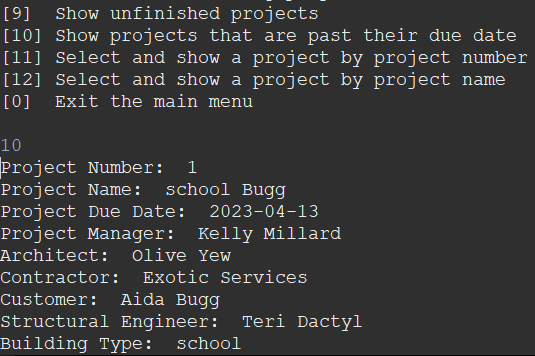
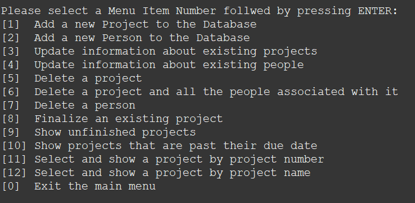

# Poise Project Management System (PMS)

**Table of Contents**

- [Author](#author)
- [Introduction](#introduction)
- [Background](#background)
- [Steps Involved](#steps)
- [Running the Program](#running)

## Author

<a href="https://github.com/HenriBranken" target="_blank">Henri Branken</a>

## Introduction

This project showcases competence in the following skills:

- Designing & Implementing a MySQL Database.
- Writing Java Code to interact with the MySQL database.
- Utilizing the java.sql library.
- Persisting & Manipulating Data with Java functions.
- Creating a data-driven program that is debugged, tested, refactored & documented.

## Background

This project involved the creation of a PMS for a firm called "Poised".
This PMS is basically a Java program with the following functionality:

- Read and Write data about people and projects.
- Capture information about new projects, and adding it to the database.
- Update information about existing projects
- Finalize an existing project
- List projects according to certain criteria
- Find projects by Project Number or Project Name.
- Delete data about projects and people associated with them.

## Steps involved

- Creating a MySQL database called PoisePMS.
- Creating Tables which include the following: 1. Projects, 2. Architects, 3. Customers and 4. Contractors
  - Please see the ERD in **`CompulsoryTask1/ERD.png`**
- Adding mock data to each table.
  - Please see **`CompulsoryTask1/Data_Insertion.sql`**
- Using the JDBC (Java EE Database Connectivity), write Java code that allows for the functionality described in the [Background](#background) section.

## Running the Program:

- Open up the directory **`CompulsoryTask2`** in Eclipse, or your favourite Java IDE.
- Navigate to **`src/(default package)/PoisePMS.java`**
- Double-click the Java program to open it up in the code editor space.
- Right-Click somewhere in the space of the code editor
- Navigate to **`Run As > Java Application`**
- From the Console, further interact with the program by Selecting a Menu Item Number, followed by pressing ENTER.
- Play around with all the different Menu items to scrutinize the functionality of the program.
- **Tip:** Ensure that the program `MySQL` in `Services` is up and running.
- **Tip:** Browse inside **`CompulsoryTask2/doc`** to see the Java documentation.

